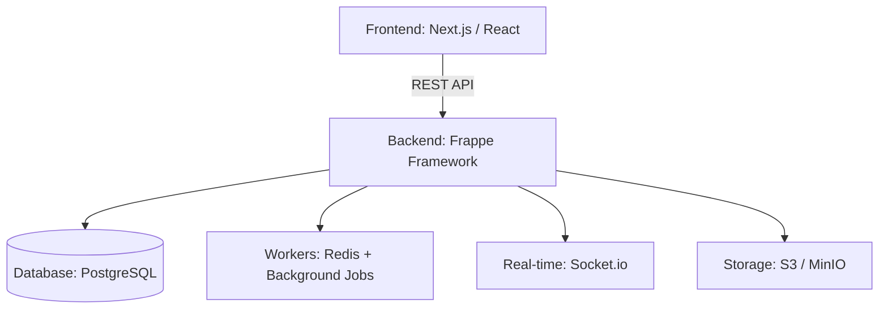

# HRMS SaaS Platform – Professional Employee Management

[](LICENSE)
[](https://frappeframework.com/)
[](https://nextjs.org/)
[](https://www.postgresql.org/)

A unified, modular HRMS SaaS platform built for the modern workforce. Designed to handle the entire employee lifecycle with a focus on mobile-first accessibility, real-time tracking, and deep automation.

---

## 🌟 The Vision

Traditional HR systems are fragmented, clunky, and fail to address the needs of a mobile or field-based workforce. Our HRMS bridges this gap by providing:

-   **Mobile-First Design**: Native support for geo-fencing and real-time attendance.
-   **API-First Architecture**: Built on the Frappe framework for extreme extensibility.
-   **Modular Scaling**: Enable only the features your organization needs.
-   **Real-time Visibility**: Instant insights into attendance, performance, and requests.

---

## 🚀 Key Features

### 🔹 MVP (Phase 1 & 2)
-   **Organization Management**: Multitenant setup with complex hierarchy support (Departments, Locations, Designations).
-   **Employee Management**: Detailed profiles, document management, and organizational charts.
-   **Geo-Based Attendance**: Precise check-in/out with GPS tracking and geo-fencing.
-   **Leave & Time Management**: Flexible leave policies, automated balances, and approval workflows.

### 🔹 Advanced Modules
-   **Recruitment**: End-to-end hiring pipeline from job posting to offer letters.
-   **Performance Management**: 360° reviews, KPI tracking, and IDP mapping.
-   **Request Desk**: Internal ticketing for HR, IT, and administrative needs.
-   **Training & Development**: Course management, certifications, and career pathing.
-   **Analytics & Reporting**: Real-time dashboards, scheduled reports, and custom insights.

---

## 🛠️ Technology Stack

| Layer | Technology |
| :--- | :--- |
| **Backend** | **Frappe Framework** (Python-based, modular, REST-first) |
| **Frontend** | **Next.js** (React) with Tailwind CSS |
| **Database** | **PostgreSQL** or MariaDB (Multi-tenant) |
| **Real-time** | **Socket.io** (Native Frappe integration) |
| **Cache/Workers** | **Redis** & Python RQ (Background jobs) |
| **Storage** | S3-compatible (MinIO / AWS S3) |

---

## 🏗️ Architecture

The platform follows a clean, decoupled architecture:



-   **Backend**: Modular Frappe apps manage specific domains (HR Core, Attendance, etc.).
-   **Multi-Tenancy**: Built-in support for multiple sites/tenants using Frappe's site architecture.
-   **API Layer**: Every action is available via REST, ensuring seamless mobile integration.

---

## 🗺️ Implementation Roadmap

### Phase 1: Core HR (The Foundation)
- [ ] Organization & Multi-tenant setup
- [ ] Employee Profile & Directory
- [ ] Geo-based Attendance APIs
- [ ] Basic Daily/Monthly Reports

### Phase 2: Leave & Time
- [ ] Leave Policy Engine
- [ ] Leave Request Workflows
- [ ] Timesheets & Overtime Calculation

### Phase 3: Recruitment & Onboarding
- [ ] Job Portal & Candidate Pipeline
- [ ] Automated Onboarding Workflows

### Phase 4: Intelligence
- [ ] Advanced Dashboard Visualizations
- [ ] AI-driven Performance Insights

---

## 📂 Project Structure

```text
.
├── documents/           # Project documentation (PRD, Architecture, Roadmap)
├── frappe_apps/         # (Coming Soon) Custom Frappe apps for HR modules
├── frontend/            # (Coming Soon) Next.js application
└── README.md            # You are here
```

---

## 🛠️ Getting Started

### Prerequisites
- Python 3.10+
- Node.js 18+
- Frappe Bench
- PostgreSQL/MariaDB

### Installation
*(Detailed installation steps will be added as codebases are initialized)*

1.  Initialize the Frappe Bench.
2.  Install the HRMS core app.
3.  Set up the Next.js frontend.

---

## 🛡️ Security & Compliance

-   **MFA Support**: Multi-factor authentication for sensitive actions.
-   **RBAC**: Granular role-based access control.
-   **Data Isolation**: Strict tenant-level isolation for SaaS security.
-   **Audit Logs**: Complete tracking of every record change.

---

## 📄 License

This project is licensed under the MIT License - see the [LICENSE](LICENSE) file for details.
